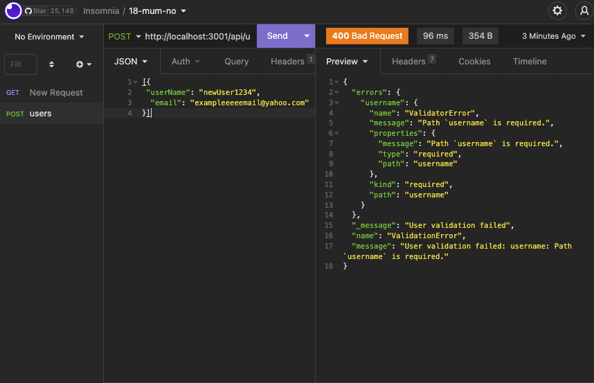

# NoSQL Challenge: Social Network API
# 18-mum-no

## Description

This is an attempt at creating a social network web application where users can share their thoughts, react to friends’ thoughts, and create a friend list. I was hoping to be able to execute CRUD methods with [MongoDB,](https://www.mongodb.com/) integrate [Mongoose](https://www.npmjs.com/package/mongoose) in an API, and create query builders to populate documents using refs.

Unfortunately, at the time of this submission I am still unsuccessful. I believe the problem lies with my use of MongoDB. But unluckily today is the final deadline so I am submitting this in the hope of getting partial credit. I will finish this next month to add to my portfolio.

[View my walkthrough video here.](https://drive.google.com/file/d/1Nmm-dpMkJRYtHLgkRUscC3LOb1tF2iNQ/view)



## User Story
```
AS A social media startup
I WANT an API for my social network that uses a NoSQL database
SO THAT my website can handle large amounts of unstructured data
```

## Acceptance Criteria
```
GIVEN a social network API
WHEN I enter the command to invoke the application
THEN my server is started and the Mongoose models are synced to the MongoDB database
WHEN I open API GET routes in Insomnia for users and thoughts
THEN the data for each of these routes is displayed in a formatted JSON
WHEN I test API POST, PUT, and DELETE routes in Insomnia
THEN I am able to successfully create, update, and delete users and thoughts in my database
WHEN I test API POST and DELETE routes in Insomnia
THEN I am able to successfully create and delete reactions to thoughts and add and remove friends to a user’s friend list
```

## Installation
Clone the project.
Then enter ```npm i```.
Initialize the application with ```npm start```.

## API Routes

```
/api/users
GET all users
GET a single user by its _id and populated thought and friend data
POST a new user:
// example data
{
  "username": "lernantino",
  "email": "lernantino@gmail.com"
}
PUT to update a user by its _id
DELETE to remove user by its _id

/api/users/:userId/friends/:friendId
POST to add a new friend to a user's friend list
DELETE to remove a friend from a user's friend list

/api/thoughts
GET to get all thoughts /api/thoughts
GET to get a single thought by its _id /api/thoughts/:id
POST to create a new thought (don't forget to push the created thought's _id to the associated user's thoughts array field)
// example data
{
  "thoughtText": "Here's a cool thought...",
  "username": "lernantino",
  "userId": "5edff358a0fcb779aa7b118b"
}
PUT to update a thought by its _id
DELETE to remove a thought by its _id

/api/thoughts/:thoughtId/reactions
POST to create a reaction stored in a single thought's reactions array field 
DELETE to pull and remove a reaction by the reaction's reactionId value /api/thoughts/:thoughtId/reactions/:reactionId
```

## Challenges

```
Deliverables: 10%
Yes - Your GitHub repository containing your application code.

Walkthrough Video: 37%
Yes - A walkthrough video that demonstrates the functionality of the social media API must be submitted, and a link to the video should be included in your README file.
Hopefully yes - The walkthrough video must show all of the technical acceptance criteria being met.
Yes - The walkthrough video must demonstrate how to start the application’s server.
Yes - The walkthrough video must demonstrate GET routes for all users and all thoughts being tested in Insomnia.
Yes - The walkthrough video must demonstrate GET routes for a single user and a single thought being tested in Insomnia.
Yes - The walkthrough video must demonstrate POST, PUT, and DELETE routes for users and thoughts being tested in Insomnia.
Yes - Walkthrough video must demonstrate POST and DELETE routes for a user’s friend list being tested in Insomnia.
Yes - Walkthrough video must demonstrate POST and DELETE routes for reactions to thoughts being tested in Insomnia.

Technical Acceptance Criteria: 40%
Satisfies all of the preceding acceptance criteria plus the following:
I think no - Uses the Mongoose package Links to an external site.to connect to a MongoDB database.
Yes - Includes User and Thought models outlined in the Challenge instructions.
Yes - Includes schema settings for User and Thought models as outlined in the Challenge instructions.
Yes - Includes Reactions as the reaction field's subdocument schema in the Thought model.
Yes - Uses functionality to format queried timestamps properly.

Repository Quality: 13%
Yes - Repository has a unique name.
Yes - Repository follows best practices for file structure and naming conventions.
Yes - Repository follows best practices for class/id naming conventions, indentation, quality comments, etc.
Yes - Repository contains multiple descriptive commit messages.
Yes - Repository contains a high-quality README with description and a link to a walkthrough video.

Bonus
Fulfilling the following can add 10 points to your grade. Note that the highest grade you can achieve is still 100:
I have the code but does it work? No - Application deletes a user's associated thoughts when the user is deleted.
```